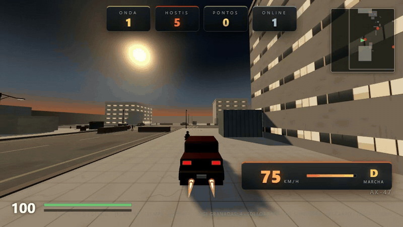
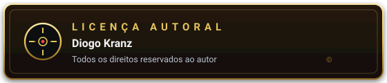

  

  <a href="https://diogokranzz.github.io/URBANA/">▶ JOGAR AGORA NO ENDEREÇO OFICIAL</a>

FPS tático urbano em português do Brasil, feito com three.js puro e Node.js sem nenhuma dependência externa em tempo de execução. O jogo roda direto no navegador com ondas de IA armada, carros dirigíveis com turbo e fogo no escapamento, multiplayer cooperativo por WebSocket e áudio sintetizado em tempo real, sem nenhum arquivo de som. Também instala no celular como aplicativo, funciona offline depois da primeira visita, tem controles de toque com joystick virtual e um seletor de qualidade gráfica no menu.

## Visão geral do projeto

URBANA é um jogo de tiro em primeira pessoa ambientado em um cruzamento urbano ao fim da tarde. O jogador escolhe um operador entre três classes, enfrenta ondas crescentes de hostis controlados por IA e pode entrar em qualquer carro da cena para dirigir, atropelar inimigos ou usar o turbo para escapar de uma encurralada. O mapa tem prédios com janelas iluminadas, vitrines de loja, postes de luz com luminária real, hidrantes, bancas de jornal, containers, muros perimetrais e faixas de pedestres.

Todos os recursos do jogo são gerados por código: as texturas são desenhadas em canvas no carregamento, os sons são sintetizados com WebAudio e os bonecos são construídos por geometria procedural. Não existe download de assets externos, o que mantém o jogo leve, rápido de abrir e fácil de hospedar.

O projeto segue a norma da língua portuguesa do Brasil em toda a interface, nos textos e no código, e não contém nenhum comentário em nenhum arquivo.

## Como executar

É necessário ter o Node.js 18 ou superior instalado.

1. Abra o terminal na pasta do projeto.
2. Execute o comando: node server.js
3. Abra o endereço: localhost na porta 8137 no navegador, com o protocolo http.

O servidor escuta apenas em 127.0.0.1 por padrão, ou seja, ninguém fora da sua máquina acessa o jogo. Para liberar o acesso na rede local, use a variável de ambiente URBANA_HOST com o valor 0.0.0.0 antes do comando, e em hospedagens de nuvem a porta é lida automaticamente da variável de ambiente PORT, que serviços como Render e Railway definem sozinhos.

A porta padrão é 8137 e o WebSocket do multiplayer responde na rota /ws do mesmo endereço, sem depender de bibliotecas externas. Se o jogo estiver publicado em um site estático e o servidor do multiplayer rodar em outro endereço, basta definir a chave de servidor personalizado no armazenamento local do navegador, com o nome urbana e o sufixo de servidor, apontando para o endereço do servidor.

## Controles

1. W A S D: mover.
2. Mouse: mirar, botão esquerdo atira e botão direito mira refinada.
3. SHIFT: correr a pé e turbo quando estiver dirigindo.
4. CTRL ou C: agachar.
5. ESPAÇO: pular.
6. R: recarregar a arma.
7. G ou 4: granada.
8. Teclas 1, 2 e 3: trocar entre AK, Deagle e Sniper.
9. Teclas 4 e 5: MP5 e Pump.
10. X: instalar ou remover o supressor da Deagle.
11. Q: painel de loadout.
12. E: entrar ou sair do carro mais próximo.
13. V: câmera em terceira pessoa.
14. TAB: placar.
15. T: chat do multiplayer.
16. ESC: pausar.

No celular o jogo traz controles próprios de toque, descritos na seção seguinte.

## Controles de toque no celular

Em telas com toque o jogo mostra seus próprios controles: um joystick virtual no canto esquerdo para mover, uma área de olhar na metade direita para girar a câmera e uma fileira de botões com as ações principais, a saber ACELERA, RÉ, TURBO, CARRO, PULAR, RECARGA, GRANADA, CÂMERA e ARSENAL. Tudo funciona ao mesmo tempo, então dá para dirigir, girar a câmera e acionar o turbo com os dois polegares. Dentro do carro o joystick acelera e faz ré, o botão CARRO sai do veículo e o turbo mantém as chamas no escapamento. O modo de toque liga sozinho em aparelhos com tela sensível e some no computador, onde seguem valendo teclado e mouse.

## Qualidade gráfica

O menu inicial tem um seletor de qualidade com três níveis. A baixa desliga sombras e névoa e usa resolução reduzida, a média traz sombras simples com resolução intermediária e a alta entrega o visual completo com sombras suaves, névoa e resolução máxima, pensada para computadores fortes. Em celulares e telas pequenas a baixa entra sozinha na primeira visita, e a escolha fica salva no navegador para as próximas partidas.

## O carro, o turbo e o escapamento

Aperte E perto de qualquer carro para assumir a direção. O boneco do jogador senta no banco do motorista, as mãos vão ao volante, que gira de verdade com a direção, e a câmera segue o carro em perseguição com o velocímetro no canto da tela. O carro acelera até cerca de 75 km/h no modo normal, faz ré e colide com postes, hidrantes e muros por toda a área da lataria, não só pelo centro.

Segurando SHIFT com W pressionado o turbo entra em ação: os dois canos do escapamento na traseira cospem chamas com núcleo amarelo e halo laranja em tremulação, o som do motor ganha um assobio de turbina com o estalo da ignição, o campo de visão abre, o velocímetro acende em laranja e o teto de velocidade sobe para cerca de 108 km/h.

  

Atropelar hostis em alta velocidade derruba os inimigos com ragdoll capotando, respingo de sangue, som de impacto na lataria e tremor de câmera, rendendo pontos de abate.

## Ondas de IA

Os hostis chegam em ondas de dificuldade crescente, todos armados, com pontaria, visão, strafe, recarga, granadas e comportamento de cobertura. A IA desliza lateralmente em paredes, troca o lado do desvio quando fica presa e refaz o destino quando necessário, sem nenhum teleporte. Entre uma onda e outra existe um intervalo curto, o escudo do operador é recarregado e o placar soma bônus de limpeza da onda.

Ao morrer aparece a deathcard K.I.A. com o dossiê da missão e o botão REIMPLANTAR, que devolve o jogador ao combate com vida, escudo e munição restaurados, mantendo a onda atual.

## Operadores

1. BOPE: colete pesado, cinquenta de escudo extra e postura de choque.
2. FACÇÃO: movimentação ágil e silenciosa, hostis demoram a notar o jogador.
3. FORÇA DELTA: recuo reduzido e mira firme, feita para operação noturna.

A escolha muda a vida máxima, o escudo, a velocidade, o recuo e o material do boneco em terceira pessoa.

## Multiplayer cooperativo

O servidor Node.js embutido roda uma sala cooperativa por WebSocket puro seguindo a norma RFC 6455, sem dependências. Jogadores remotos aparecem como bonecos completos com placas de nome, interpolação suave e caminhada procedural, os tiros remotos rendem tracers, clarão e áudio com pan espacial, e o chat fica na tecla T.

A antifraude é inteiramente no servidor: limite de velocidade com correção de posição, limite de cadência de tiro por arma, limite de dano alegado, taxa de mensagens com token bucket, sanitização de nomes, teto de conexões por IP e cabeçalhos de segurança como CSP, nosniff e bloqueio de frames. Nada é gravado em disco, as salas vivem apenas na memória.

O recorde pessoal do jogador fica salvo no próprio navegador: a melhor pontuação, a maior onda e o total de abates aparecem em dourado no menu inicial, prontos para serem batidos.

## Arquitetura do código

1. server.js: servidor estático endurecido com rate limit, bloqueio de dotfiles e resolução canônica de caminhos, além da sala multiplayer com antifraude.
2. src/main.js: loop principal, entrada, câmera, HUD, ondas, granadas, carro com turbo, atropelamento e telas de menu e morte.
3. src/world.js: construção do mapa, texturas procedurais, iluminação, prédios, postes, carros e colisores.
4. src/entities.js: fábrica de bonecos operadores, jogador e IA inimiga com ragdoll.
5. src/weapons.js: viewmodel em primeira pessoa, balística, recuo, mira e supressor.
6. src/audio.js: síntese de todos os sons, do estouro das armas ao motor do carro.
7. src/fx.js: tracers, impactos, sangue, cápsulas ejetadas, fumaça e explosões.
8. src/physics.js: colisão AABB, movimento de cápsula com step up e balística por segmento.
9. src/net.js: cliente de WebSocket com reconexão automática e interpolação de jogadores remotos.
10. index.html: telas, HUD, velocímetro e estilos.
11. vendor/three.module.js: biblioteca three.js r160 vendada localmente, mantida intacta por ser código de terceiros.
12. manifest.json: manifesto do aplicativo web com nome, cores e ícones.
13. sw.js: service worker que guarda o jogo em cache para funcionar sem internet.
14. O pequeno script de registro do service worker, que também checa atualizações em segundo plano.

## Publicação

O jogo está publicado e sempre no ar no GitHub Pages, no endereço https://diogokranzz.github.io/URBANA/ , servido pelo branch de publicação deste repositório.

A publicação é automática: a cada envio para o branch principal, o GitHub Actions valida todos os arquivos JavaScript e republica o site sozinho, sem nenhum passo manual. O site também carrega capa de compartilhamento, título e descrição, então o link aparece bonito e com imagem de preview no WhatsApp, no Discord e em redes sociais.

Nesse cenário estático o modo individual funciona por completo; o multiplayer exige um servidor Node.js ativo, então para manter o multiplayer no ar com salas e chat é preciso uma hospedagem que rode Node, como Render ou Railway. O projeto já está pronto para isso: o comando de start é node server.js, a porta vem da variável de ambiente PORT e o host liberado vem de URBANA_HOST. Localmente, basta rodar node server.js e o multiplayer volta a funcionar na rede da sua máquina.

O pacote publicado também é um aplicativo web progressivo: inclui o manifesto, o service worker e os ícones, então o site publicado pode ser instalado no celular pela opção do navegador e as partidas individuais continuam funcionando sem internet depois da primeira visita.

## Licença

  

Projeto feito por Diogo Kranz. Todos os direitos estão reservados ao autor, que é o único detentor do projeto e de tudo que o compõe. É proibido copiar, reproduzir, redistribuir, vender, modificar ou criar obras derivadas, no todo ou em parte, sem autorização prévia e por escrito do autor.

Quem quiser usar qualquer parte deste projeto precisa de permissão expressa de Diogo Kranz, e o texto completo da autorização e das restrições está no arquivo da [licença completa do projeto](./LICENSE).

Todos os direitos reservados a Diogo Kranz.
